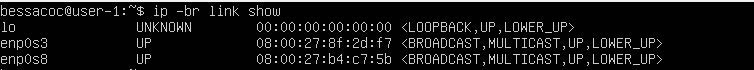
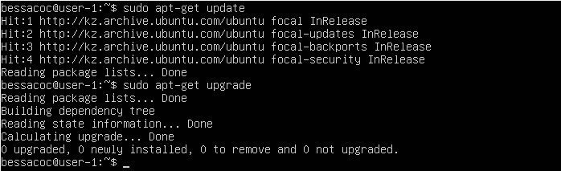
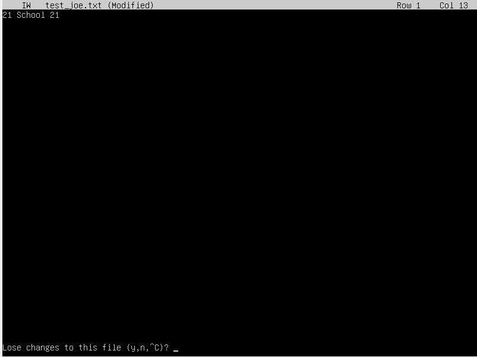
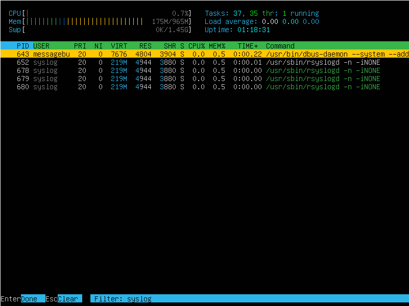

## Part 1. Установка ОС
**== Выполнение ==**

## Part 2. Создание пользователя
**== Выполнение ==**

- Создал нового пользователя user с помощью команды sudo adduser user 

- Добавил данного пользователя в группу adm: sudo usermod -a -G adm user

- Вывод команды cat /etc/passwd

## Part 3. Настройка сети ОС ##
**== Выполнение ==**

- Ввел команду `sudo hostname user-1`, чтобы задать имя хоста

- Ввел команду `sudo timedatectl set-timezone Asia/Aqtobe`

- Вывел названия сетевых интерфейсов командой `ip -br link show`

* lo (loopback device) - виртуальный сетевой интерфейс, присутствующий в Linux, используемый для отладки сетевых программ и запуска серверных приложений локально. Ему присвоен адрес 127.0.0.1 и DNS-имя "localhost".

- Получим ip-адрес устройства от DHCP-сервера

* DHCP (Dynamic Host Configuration Protocol), или протокол динамической настройки узла, представляет собой сетевой протокол, позволяющий автоматически назначать сетевым устройствам IP-адреса и другие важные параметры, необходимые для функционирования в сети TCP/IP.

- Вывел внешний ip-адрес шлюза командой `curl icanhazip.com`

- Вывел внутренний ip-адрес шлюза командой `hostname -I`

- Задаем статичные настройки ip, gw, dns используем публичный DNS серверы 
- откройем файл конфигурации YAML в текстовом редакторе: `sudo nano /etc/netplan/00-installer-config.yaml`

- Для применения внесенных изменений выполняем 

- Чекаю что сетевой интерфейс настрроен на использование статического IP-адреса с помощью ip `route show`

- Перезапустил виртуальную машину и проверил, что файл с настройками не изменился

- Пингуем удаленные хосты 1.1.1.1 и ya.ru

## Part 4. Обновление ОС
**== Выполнение ==**

- Обновил системные пакеты до последней на момент выполнения задания версии

## Part 5. Использование команды sudo
**== Выполнение ==**

- Разрешаем пользователю, созданному в Part 2, выполнять команду sudo

* Sudo (от английской фразы "Substitute User and do", дословно "подменить пользователя и выполнить") – это программа для управления UNIX-системами, которая позволяет делегировать определенные привилегии пользователям с записью информации о выполняемых операциях. Основной концепцией является предоставление минимально необходимых прав пользователям для выполнения задач, при этом ограничивая их привилегии в системе.

- Поменяем hostname ОС от имени пользователя

## Part 6. Установка и настройка службы времени
**== Выполнение ==**

## Part 7. Установка и использование текстовых редакторов
**== Выполнение ==**

- В текстовом редакторе vim, nano, joe напишите свой никнейм, закройте файл с сохранением изменений

**Joe**

- Для выхода и сохр ctrl + k + x

**Nano**

- для save ctrl + o, enter, для exit ctrl + x

**Vim**

- для выхода и сохр shift :, wq!

- Доказательства сохранения 

- Используя каждый из трех выбранных редакторов, откроем файл на редактирование, отредактируем файл, заменив никнейм на строку "21 School 21", закроем файл без сохранения изменений.

**Joe**

- Для выхода из joe без сохранения изминений control + c и y:

**Nano**

- Для выхода из nano без сохранения изминений нажимаем control + x и n.

**Vim**

- Для выхода из vim без сохранения изминений нажимаем shift + :, и вписываем q!.

- Используя каждый из трех выбранных редакторов, отредактируем файл ещё раз (по аналогии с предыдущим пунктом), а затем осваиваем функции поиска по содержимому файла (слово) и замены слова на любое другое
**Joe**

- Для поиска control + k + f

- Для замены вводим R и слово на которое хотим заменить

**Nano**

- Поиск слова в nano control + w

- Для замены слово control + \

**Vim**

- Для поиска в vim вводим команду ":s/искомое слово/замена слова"

## Part 8. Установка и базовая настройка сервиса SSHD
**== Выполнение ==**

- Установим SSH & openssh:

- служба SSHd работает

- Поменял Port на 2022

- Перезапустил службу SSH, чтобы изменения вступили в силу: sudo systemctl restart ssh

- проверил запущен ли ssh-демон на сервере 

* Команда ps, сокращенно от Process Status, представляет собой утилиту командной строки, используемую для просмотра информации, связанной с процессами, которые запущены в операционной системе Linux.

* Опция a отображает идентификаторы процессов и состояния идентификатора сеанса для каждого реального пользователя.

* Опция u предоставляет детальную информацию о процессах, включая ширину экрана по умолчанию, формат виртуальной памяти с расширенными функциями, а также общую пользовательскую настройку управления форматом вывода.

* Опция x включает следующие столбцы: PID, TTY, STAT, TIME, COMMAND. Результат вывода с опцией x аналогичен результату вывода с опцией u, однако разница заключается в том, что опция x также отображает процессы, которые выполняются без привязки к какому-либо экрану терминала.

* Опция f используется для отображения процессов в виде древовидной структуры, что включает дочерние процессы каждого процесса.

* Команда grep sshd фильтрует вывод, отображая только строки, содержащие ключевое слово "sshd".

- Выполнил `reboot и netstat -tan`

* Опция a предоставляет перечень всех портов и установленных соединений, независимо от их текущего состояния или используемого протокола.

* Опция t выводит информацию только о портах, использующих протокол TCP (Transmission Control Protocol).

* Опция n отображает числовые IP-адреса вместо их обычных имён.

* Опция tan выведет список всех портов TCP, включая адреса и номера портов.

- Информация в столбцах:

    * Proto — Протокол (tcp, udp, raw), который используется сокетом.

    * Recv-Q — Количество байт, ожидающих копирования из сокета программой пользователя.

    * Send-Q — Количество байт, ожидающих подтверждения удаленным узлом.

    * Local Address — Адрес и номер порта локального конца сокета.

    * Foreign Address — Адрес и номер порта удаленного конца сокета.

    * State — Состояние сокета. Например, состояние LISTEN указывает, что сокет ожидает входящих подключений.

- Значение 0.0.0.0.

* IP-адрес 0.0.0.0 является нероутинговым адресом IPv4, который используется в различных контекстах, преимущественно как адрес по умолчанию или заполнительный адрес.  Он выступает в роли резервного адреса, пока не будет назначен реальный маршрутизируемый IP-адрес.

## Part 9. Установка и использование утилит top, htop
**== Выполнение ==**

- Установил `htop sudo apt install htop`
- Ввел  `top`

- uptime: 55 min
- user : 1
- загрузка системы: 0.00
- общее кол-во процессов: 105
- загрузку памяти: 173.2 из 964.9
- pid процесса занимающего больше всего памяти: 1

- htop, отсортированный по PERCENT_CPU

- htop, отсортированный по PID

- htop, отсортированный по PERCENT_MEM

- htop, отсортированный по TIME

- htop, поиск процесса syslog

- htop, для процесса sshd

- Вывод 

## Part 10. Использование утилиты fdisk
**== Выполнение ==**

- название жесткого диска /dev/sda
- размер 10 GiB
- кол-во секторов 20971520
- размер swap 10 GiB

## Part 11. Использование утилиты df
**== Выполнение ==**

- Выполнил `df & df -Th`

- df 
- размер раздела: 8408452 КБ
- размер занятого пространства: 4230700 КБ
- размер свободного пространства: 3729035 КБ
- процент использования: 54%

* Единица измерения: Кб (по умолчанию объем дискового пространства выводится в килобайтах, если не указан специальный ключ).

- df -Th
- размер раздела: 8.1 ГБ
- размер занятого пространства: 4.1 ГБ 
- размер свободного простанства: 3.6 ГБ
- процент использования: 54%

* Тип файловой системы для раздела: ext4 – это файловая система с поддержкой журналирования.

## Part 12. Использование утилиты du
**== Выполнение ==**
- командой `sudo du -she /home /var/log /var` узнал сколько дискового пространства используется в указанных директориях.

- командой ` sudo du -sh /var/10g/* ` узнал сколько дискового пространства используется в каждой из поддеректорий в указанной директории.

## Part 13. Установка и использование утилиты ncdu
**== Выполнение ==**

- Вывел размер папки /home

- Вывел размер папки /var

- Вывел размер папки /var/log

## Part 14. Работа с системными журналами
**== Выполнение ==**

- можно быстро увидеть последние события, которые произошли в системе, и проверить вывод ядра на наличие сообщений об ошибках или других интересующих событиях.

- содержит системные сообщения, логи и события операционной системы. Эта команда позволяет быстро просмотреть последние записи, мониторировать события и искать ошибки.

- Сообщение о рестарте. Позволяет быстро просмотреть последние события в файле аутентификации и выделить только те строки, которые содержат информацию о сеансах SSH (Secure Shell).

## Part 15. Использование планировщика заданий CRON
**== Выполнение ==**

- Редактирую список задач: sudo crontab -e

- Нашел в системном журнале строчки о выполнении:

- Список текущих заданий для CRON.
